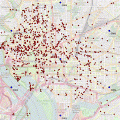

# LoRaMob: An Open Dataset for Mobile LoRaWAN

This repository contains two datasets collected from emulated LoRaWAN networks: one spanning **11 days with ADR** and another covering **28 days without ADR**. 

The **full dataset** is hosted on **Nextcloud** due to its large size. In this repository, we provide a **3-day example dataset** and **scripts** to process and analyze the data.

## Demo Video

<a href="https://box.roc.cnam.fr/index.php/s/YHMkGDR8JxQiNj9" style="font-size: 24px; font-weight: bold; color: #007bff;">Click here to view the video.</a>

### Demo Animation

---

## 🗂 Dataset Access and Structure

### 📁 **What’s in GitHub?**
The GitHub repository includes:
1. **Example Data**:  
   - A 3-day subset of the dataset in CSV format.  
     - Located in `example_data/`.
       - `with_adr/`: Contains 3 days of data with ADR.
       - `without_adr/`: Contains 3 days of data without ADR.

2. **Scripts**:  
   - Tools for processing and analyzing the data.  
     - `app_data_json_to_csv.py`: Converts JSON files to CSV.
     - `combine_csv.py`: Merges multiple CSV files into one.
     - `remove_duplicates.ipynb`: Removes duplicate records from the dataset.

3. **Documentation**:  
   - This `README.md` explains the dataset and repository structure.
   - Guidelines for getting started with the dataset and scripts.

---

### 🌐 **What’s on Nextcloud?**
The full dataset is hosted on Nextcloud due to its large size. Download it using [this link](https://box.roc.cnam.fr/index.php/s/QY44oZsdymTwmAQ). To get the password for access, contact moheed-ali.kayani@cnam.fr.

#### Full Dataset Structure:
- **11 Days with ADR**:
  - Infrastructure dataset:
    - Monitoring (JSON)
  - Network dataset:
    - Prometheus
    - Application (JSON)
    - Gateway (JSON)
- **28 Days without ADR**:
  - Infrastructure dataset:
    - Monitoring (JSON)
  - Network dataset:
    - Prometheus (JSON)
    - Application (JSON)
    - Gateway (JSON)

---

## 🚀 Getting Started

### 1. **Explore the GitHub Repository**
   - Start with the **3-day example dataset** in `example_data/`.
   - Use the provided scripts to process and analyze the data.

### 2. **Download the Full Dataset**
   - Access the complete dataset from [Nextcloud](https://box.roc.cnam.fr/index.php/s/QY44oZsdymTwmAQ).

### 3. **Process the Data**
   - Use the scripts included in the `scripts/` directory:
     - `app_data_json_to_csv.py`: Converts application JSON files to CSV.  
       _Ensure paths in the script are updated before use._
     - `combine_csv.py`: Merges multiple CSV files into one.
     - `remove_duplicates.ipynb`: Removes duplicate records caused by overlapping buffers during data collection.

### 4. **Analyze the Data**
   - Explore up events or the rest of the dataset as per your analysis goals.

---

## 📜 Dataset Description

The dataset was generated using:
- Mobility data from **bike-sharing endpoints and travel times**.
- Emulation tools like **elora**, a LoRaWAN module for NS-3 designed for massive networks ([elora GitHub Repository](https://github.com/Orange-OpenSource/elora)).
- Network and application servers implemented using **ChirpStack** ([chirpstack-docker](https://github.com/non-det-alle/chirpstack-docker.git)).

### Characteristics:
- Emulated for **4,000 devices** and **7 gateways**.
- Covers an area of **116.877 km²**.
- Includes:
  - **11 days with ADR**: Emulated network behavior with ADR.
  - **28 days without ADR**: Emulated network behavior without ADR.

### Publication:
The dataset creation process and its characteristics are described in the following paper:
> **Paper Title:** (Insert paper title)  
> **DOI/Link:** (Insert paper link)  
> Please refer to this paper for additional details about the dataset.

---

## ✨ Usage Policy

Any use of this dataset, whether for public or private purposes, **must cite the following paper**:  
> **Paper Title:** (Insert paper title)  
> **DOI/Link:** (Insert paper link)

---

## 🛠 Scripts

The repository provides the following scripts for working with the dataset:
- **`app_data_json_to_csv.py`**: Converts application JSON files into CSV format.
- **`combine_csv.py`**: Merges multiple CSV files into one.
- **`remove_duplicates.ipynb`**: Removes duplicate records from the dataset.

---

## 🤝 Acknowledgments

This work was funded by the **French ANR INTELLIGENTSIA project** (grant nb: ANR-20-CE25-0011).  
We thank the contributors and collaborators for their support in the data collection and processing.

---

## 📧 Contact

For questions or feedback, please create an issue in this repository or contact us at [moheed-ali.kayani@cnam.fr].
